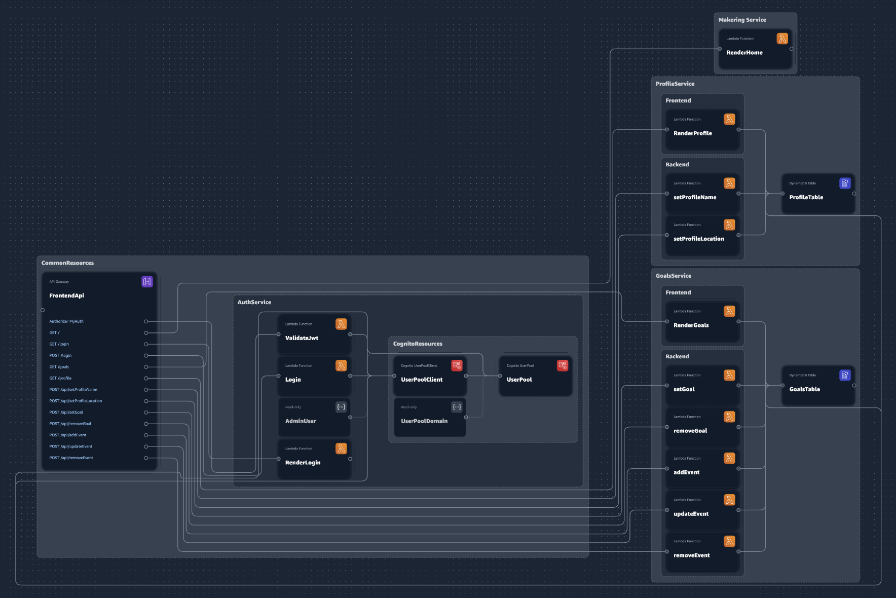

# SSR Preact Fullstack App with App Composer

This is an example of writing Lambda functions that SSR Preact pages
along with lambas for backend crud operations. This exampel also
has cognito login and auth

## Note on state of example

There are some hardcoded values in the lambda functions. These need to be
replaced by references to lambda env variables
